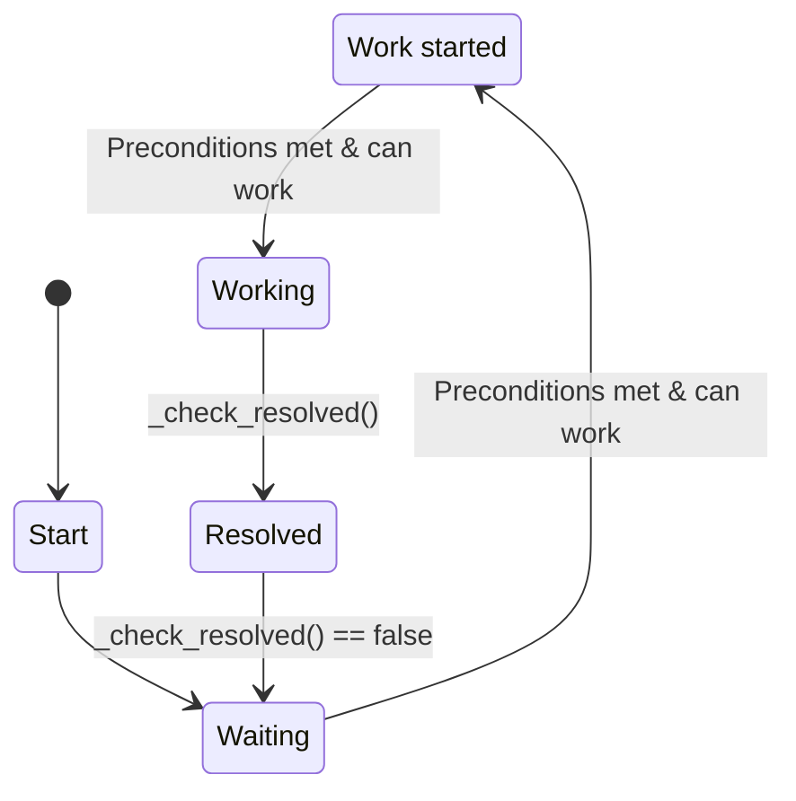

# LTP - Long Term Planning

LTP is a framework for long term planning in game agents. 
It helps you build need driven AIs that have long term goals. 
LTP allows you to break down big, complex tasks into manageable parts.
These small objectives are always scored for importance, so your agents don't forget to drink while collecting wood for their new mega base. 

The framework lets you define Objectives and how to achieve them, the architecture, updates, states and scoring is handled and supported by the LTP.

## The Idea:
Every Objective has a state that changes after checks you are able to define. 
Every Objective has preconditions that need to be met before work can start. 
The preconditions  of an Objective are Objectives again. 
So only if all Objectives a higher level Objective depends on are resolved work on the hier level can start. 

Root Objectives with a tree of Preconditions beneath them are conceptually thought to be long lasting. This might e.g. be the below shown dont't starve Objective. 
Tasks on the other hand are single shot by design. They will be automatically removed after they are resolved whereas the dont't starve Objective will just deactivate for a while. 
A Task might be to chop a specific tree, an objective is to allways have wood around for a fire. 


<div align="center">
  
</div>
The image shows the Objective hierarchy of the included demo. 
It shows the root Objective "dont't starve". When worked at ( food below 10 ) it generates a task "gather food". 
Food can only be gathered when at a farm, so the gathering has the precondition to go to a farm.

The demo code for the goto farm objective. Pretty easy, right?
```python
class_name GotoFarm extends Objective

var target_farm

func _init(a: Agent, target: Node2D) -> void:
	super(a, "Go to farm")
	target_farm = target.position

func _work():
	agent.move_towards(target_farm)

func _check_resolved():
	return (agent.position - target_farm).length() < 10

```
LTP includes a ticker, that by default, generates a tick every second. 
Every Agent can only work on a a single Objective at a time.
So if the Objective is activly worked on by the Agent _work is called once per tick.

The actor chooses a new Objective using the score. So the higher the score the higher the chance to start an objective. 
Once an Actor decides to start a task it usually sticks to it until it is done. 
This is achieved by artificially increasing the score a bit once the task is started, if another task has a higher score the Agent will switch to this task though. 
The idea behind this behavior is that in general it's not good idea to stop a task half way through, but sometimes there might be something that is more pressing than the current task, like the agent starving. 

Here is the code of gather food which is a bit more complicated.
```python
class_name GatherFood extends Objective

var gathering_progress = 0

func _init(a: Agent) -> void:
	super(a, "Gather food")
	var parent = agent.get_parent()
	## usually you would do that using globals so an autoload or something
	var farms = [parent.get_node("Farm"), parent.get_node("Farm2"), parent.get_node("Farm3")]
	var farm_to_gather_from = farms.pick_random()
	add_precondition(GotoFarm.new(agent,  farm_to_gather_from), "gather_food")

func _work():
	gathering_progress = gathering_progress + 1

func _stop_work():
	agent.food = agent.food + 5

func _check_resolved():
	return gathering_progress > 10 # time it takes to gather food

func _reset():
	gathering_progress = 0
```

## General States of an Objective

